[Fábio Ayres, Dr.](http://lattes.cnpq.br/6229400946752974). Machine Learning.
[Insper](https://github.com/Insper), 2024.

# Stock Price Prediction

This project aims to compare the performance of 2 different nature machine
learning models performance in predicting stock prices.

## Dataset

Tick-level updates of the best bid and best ask on an order book. COIN-Margined
contracts are a type of derivatives that obtain their value from the underlying
cryptocurrency they represent. These financial tools offer an alternative way to
gain exposure to cryptos without owning them. They also provide a unique
opportunity for long-term investors to participate in the futures markets
without converting their crypto assets to stablecoins.
[Learn more](https://www.binance.com/en/blog/futures/coinmargined-or-usd%E2%93%A2margined-what-futures-contract-suits-you-421499824684903739).

Binance COIN-Margined Futures Book Ticker:

| Field Name         | Description                                 |
| ------------------ | ------------------------------------------- |
| `update_id`        | Unique identifier for the order book update |
| `best_bid_price`   | Highest price buyers are willing to pay     |
| `best_bid_qty`     | Quantity available at the highest bid price |
| `best_ask_price`   | Lowest price sellers are willing to accept  |
| `best_ask_qty`     | Quantity available at the lowest ask price  |
| `transaction_time` | Timestamp of the transaction                |
| `event_time`       | Timestamp when the event was recorded       |

Binance. **Historical Market Data**. 2024.
https://www.binance.com/en/landing/data.

### Selected coins

| Symbol | Name                                                                           | Start time | End time   |
| :----: | ------------------------------------------------------------------------------ | ---------- | ---------- |
| `ADA`  | [Cardano](https://www.binance.com/en/price/cardano)                            | 2024-04-01 | 2024-04-07 |
| `AXS`  | [Axie Infinity](https://www.binance.com/en/price/axie-infinity)                | 2024-04-01 | 2024-04-07 |
| `BTC`  | [Bitcoin](https://www.binance.com/en/price/bitcoin)                            | 2024-04-01 | 2024-04-07 |
| `DOGE` | [DOG•GO•TO•THE•MOON](https://www.binance.com/en/price/dog-go-to-the-moon-rune) | 2024-04-01 | 2024-04-07 |
| `NEAR` | [NEAR Protocol Price](https://www.binance.com/en/price/near-protocol)          | 2024-04-01 | 2024-04-07 |

### Exploratory Analysis

<details>

| Symbol |                 Day 1                 |                 Day 2                 |                 Day 3                 |                 Day 4                 |                 Day 5                 |
| :----: | :-----------------------------------: | :-----------------------------------: | :-----------------------------------: | :-----------------------------------: | :-----------------------------------: |
| `ADA`  |   |   | 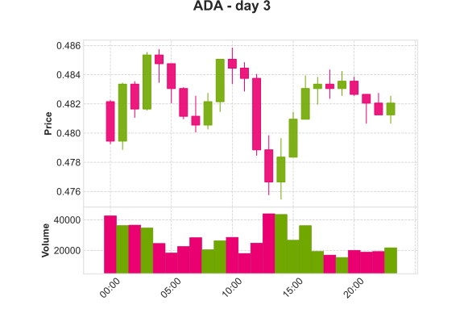  |   | 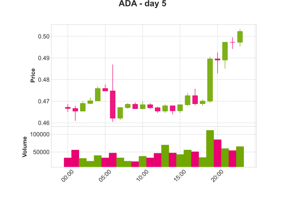  |
| `AXS`  | 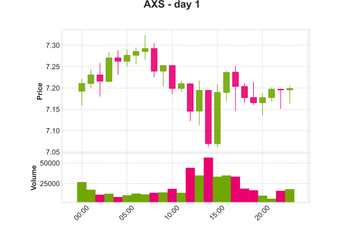  |   |   |   |   |
| `BTC`  |   |   |   |   |   |
| `DOGE` | 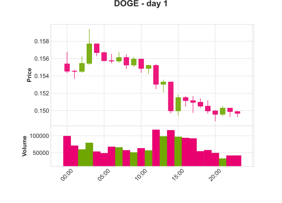 | 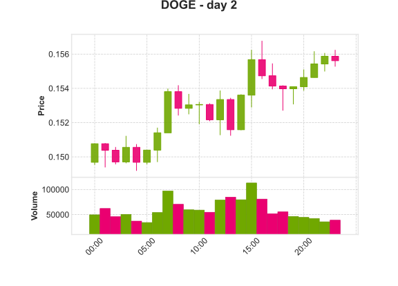 | 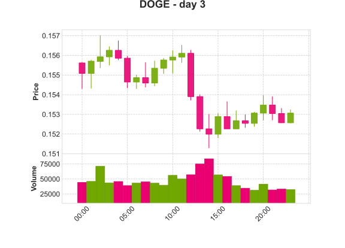 |  | 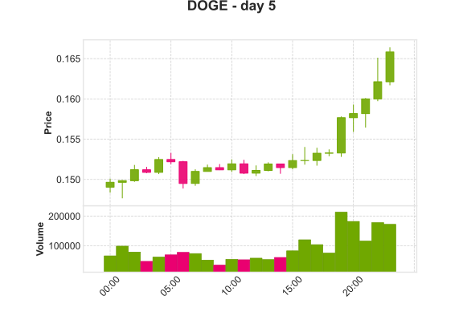 |
| `NEAR` | 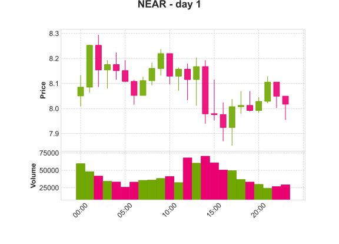 |  | 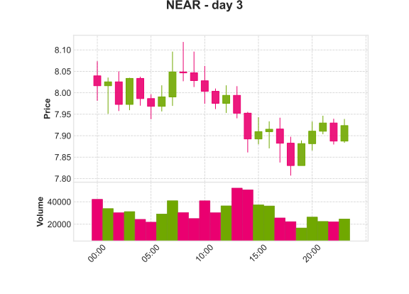 | 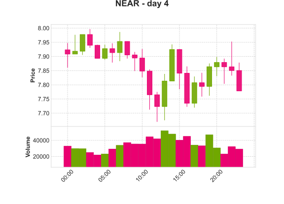 | 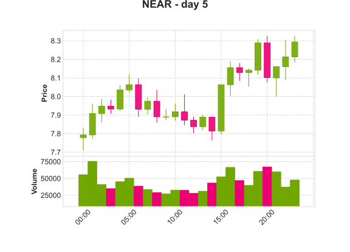 |

</details>

### Download datasets

You can download the necessary datasets by running the `pull-data.py` script
located in the `script` directory:

#### macOS/Linux

```sh
python3 ./script/pull-datasets.py
```

### Run data preprocessing

You can preprocess all datasets by running the `preprocess.py` script located in
the `script` directory:

#### macOS/Linux

```sh
python3 ./script/preprocess.py
```

#### Windows

```ps
python .\script\pull-data.py
```

## Authors

<table>
   <tr>
      <td align="center">
         <a href="https://github.com/LuisAntonioBordignon"><br />
         Luís Antônio Bordignon</a>
      </td>
      <td align="center">
         <a href="https://github.com/FelixLuciano"><br />
         Luciano Felix</a>
      </td>
   </tr>
</table>

## Data disclaimer

Please note that our project follow the
[Binance Terms of Use](https://www.binance.com/en/terms).

Without written consent from Binance, the following commercial uses of Binance
data are prohibited:

1. Trading services that make use of Binance quotes or market bulletin board
   information.
2. Data feeding or streaming services that make use of any market data of
   Binance.
3. Any other websites/apps/services that charge for or otherwise profit from
   (including through advertising or referral fees) market data obtained from
   Binance.

> [!CAUTION] You hereby understand and agree that Binance will not be liable for
> any losses or damages arising out of or relating to:
>
> - (a) any inaccuracy, defect, or omission of digital assets price data,
> - (b) any error or delay in the transmission of such data,
> - (c) interruption in any such data,
> - (d) regular or unscheduled maintenance carried out by Binance and service
  > interruption and change resulting from such maintenance,
> - (e) any damages incurred by other users’ actions, omissions or violation of
  > these terms,
> - (f) any damage caused by illegal actions of other third parties or actions
  > without authorized by Binance; and
> - (g) other exemptions mentioned in disclaimers and platform rules issued by
  > Binance.
